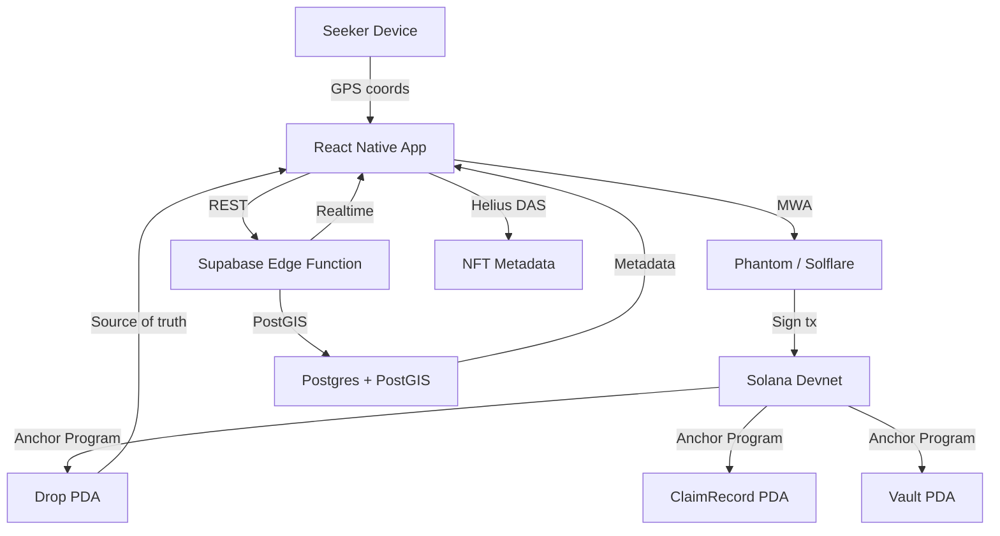

# LOOT DROP — Solana Mobile Hackathon Submission

## One-Line Pitch
GPS-based on-chain asset scavenger hunt — go outside, claim real crypto, own it forever.

## Core Loop (30 seconds)
1. Open app → see drops pulsing on the map nearby
2. Walk toward the nearest glowing marker
3. Enter the claim zone → CLAIM button activates
4. Tap → wallet signs → NFT/SOL lands in your wallet
5. Check inventory, climb the leaderboard

## Why It Wins On Each Criterion

### Stickiness & Product Market Fit
- Daily active usage driver: drops expire in 72h, forcing regular check-ins
- Social layer: leaderboard creates friendly competition between users  
- Creator economy: anyone can pin drops, driving a supply-side flywheel
- Real stakes: actual SOL/NFTs on-chain create genuine excitement
- Seeker-native: the device's always-on GPS is the core product enabler

### User Experience
- Zero crypto complexity for claimers — connect wallet, walk, tap
- Dark game-HUD aesthetic feels native to the Seeker device
- Rarity system creates dopamine hierarchy (Common → Legendary)
- Haptic + animation feedback on successful claim
- Developer mode lets judges test without physically moving

### Innovation / X-Factor
- First GPS-gated on-chain asset distribution mechanism on Solana
- Trustless proximity verification via on-chain timestamp + client-provided distance
- PostGIS + Supabase Edge Functions for sub-10ms geospatial queries
- Vault PDA architecture ensures creator funds are always recoverable
- Geohash indexing for O(1) proximity cell lookups

### Presentation & Demo Quality
- Seeded Devnet drops in San Francisco (Union Square Legendary drop)
- One-tap teleport in Developer Mode for judges
- Fullscreen animated map, pulse markers by rarity tier
- End-to-end claim flow demo-able in under 30 seconds

## Seeker-Exclusive Features
- **Seed Vault**: MWA makes transaction signing seamless — no popups, just a native auth flow
- **Always-on GPS**: Background location ready for future push alerts when drops are nearby
- **Form factor**: Portrait-first, dark UI designed specifically for the Seeker's screen

## Technical Architecture

## Demo Instructions
1. Install the APK from the Releases page
2. Connect any Devnet wallet (Phantom, Solflare, or any MWA-compatible wallet)
3. Open the **Profile** tab → enable **Developer Mode**
4. GPS is now overridden to Union Square, San Francisco
5. You'll see the **Genesis Relic** Legendary drop pulsing on the map
6. Tap the marker → tap **Claim** → sign in your wallet
7. Check the **Inventory** tab to see your claimed loot

## Team
Built for the Solana Mobile Hackathon

## Repo
https://github.com/UncleTom29/Loot-Drop
